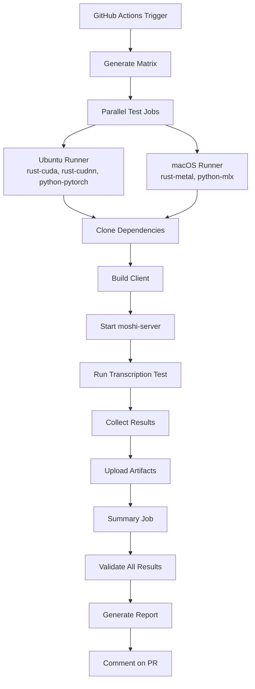

# 🧪 Moshi Test Matrix

> ⚠️ **IMPORTANT DISCLAIMER - EXAMPLE PROJECT ONLY** ⚠️
> 
> This repository serves as a **proof-of-concept and educational example** only. It will **NOT** be actively developed or maintained for the following critical limitations:
>
> ### 💰 **Cost Limitations**
> - **macOS runners**: Require GitHub Enterprise (not available on free accounts) + expensive billing
> - **CUDA runners**: Require GitHub Enterprise + GPU-enabled runners (costly)
> - **Windows runners**: Also billed and not free
>
> ### 🚫 **Technical Limitations**
> - **Act (local testing)**: Cannot simulate macOS or Windows runners (Linux only)
> - **Platform incompatibility**: Even with act, Linux+CUDA tests cannot run on macOS hardware anyway
> - **Enterprise dependency**: Most specialized runners require GitHub Enterprise accounts
>
> ### 📚 **Purpose**
> This repository demonstrates:
> - GitHub Actions matrix strategy design
> - Multi-platform CI/CD architecture concepts
> - Workflow isolation techniques
> - Act local testing setup (with limitations)
>
> **No further development is planned.** Use this as a reference for learning GitHub Actions patterns.

---

[](https://github.com/jeanjerome/moshi-test-matrix/actions/workflows/test-matrix.yml)
[](https://opensource.org/licenses/MIT)

> Automated testing matrix for **moshi-server** compatibility across multiple clients, configurations, and audio samples with perfect isolation.

## 🎯 Overview

This project provides comprehensive automated testing for [moshi-server](https://github.com/kyutai-labs/moshi) using a **GitHub Actions matrix strategy** with **perfect isolation** via separate runners for each test combination.

### ✨ Key Features

- 🔄 **Matrix Testing**: 5 clients × 2 configs × 2 audio files = **20 test combinations**
- 🏃 **Runner Isolation**: Each test runs in a dedicated GitHub Actions runner  
- 📦 **Clone on Demand**: Dependencies fetched fresh for each test (no repo bloat)
- 🧪 **Local Testing**: Use [Act](https://github.com/nektos/act) to run the same workflow locally
- 📊 **Rich Reporting**: Automated result validation and PR comments

## 🚀 Quick Start

### Using Act (Local Testing)

```bash
# Install Act (requires Docker)
brew install act  # macOS
# or choco install act-cli  # Windows

# Run entire test matrix locally
act

# Run specific job for debugging
act -j test

# List available jobs
act --list
```

### Manual Testing (Legacy)

```bash
# Only validate-results.py remains as a standalone script
python3 scripts/validate-results.py --results-dir results/
```

## 📊 Test Matrix

### Supported Clients

| Client | Description | Ubuntu | macOS |
|--------|-------------|--------|-------|
| `rust-cuda` | Rust with CUDA acceleration | ✅ | ❌ |
| `rust-cudnn` | Rust with CUDNN acceleration | ✅ | ❌ |
| `rust-metal` | Rust with Metal acceleration | ❌ | ✅ |
| `python-pytorch` | Python with PyTorch | ✅ | ❌ |
| `python-mlx` | Python with MLX (Apple Silicon) | ❌ | ✅ |

### Test Configurations

| Config File | Description | Language Support |
|-------------|-------------|------------------|
| `config-stt-en_fr-hf.toml` | Bilingual model | English + French |
| `config-stt-en-hf.toml` | English-only model | English only |

### Audio Samples

| File | Language | Duration | Description |
|------|----------|----------|-------------|
| `bria.mp3` | French | ~10s | French speech sample |
| `sample_fr_hibiki_crepes.mp3` | French | ~15s | French conversation |

## 🏗 Architecture



### Runner Strategy

- **Perfect Isolation**: Each test combination runs in a fresh runner
- **OS Mapping**: Automatic client-to-OS assignment via `include`/`exclude`
- **Parallel Execution**: All tests run simultaneously for speed
- **Resource Optimization**: Intelligent caching of dependencies

## 🔧 Dependencies Management

### External Sources (Cloned on Demand)

| Repository | Content | Usage |
|------------|---------|--------|
| [kyutai-labs/moshi](https://github.com/kyutai-labs/moshi) | Rust & Python clients | Extracted per job |
| [kyutai-labs/delayed-streams-modeling](https://github.com/kyutai-labs/delayed-streams-modeling) | TOML configs | Copied per job |

### Local Files (Versioned)

- 🎵 `audio/*.mp3` - Audio test samples (modifiable)
- 🔧 `.actrc` - Act configuration for local testing
- 📋 `scripts/validate-results.py` - Result validation tool

## 📈 Workflow Triggers

The test matrix runs automatically on:

- 🔀 **Push** to `main` or `develop` branches
- 🔍 **Pull Requests** to `main`
- ⏰ **Daily Schedule** at 2 AM UTC
- 🎯 **Manual Dispatch** via GitHub UI

## 📊 Results & Reporting

### Automated Validation

Each test produces a structured result:

```json
{
  "test_id": "rust-metal_config-stt-en-hf_bria",
  "timestamp": "2024-01-15T10:30:00Z", 
  "client_type": "rust-metal",
  "config_file": "config-stt-en-hf.toml",
  "audio_file": "bria.mp3",
  "status": "success",
  "runner_os": "macOS",
  "workflow_run": 42
}
```

### PR Integration

Pull requests automatically receive a comment with:
- ✅ **Success/Failure** summary
- 📊 **Test statistics** (total, passed, failed)
- 🔗 **Direct links** to detailed logs
- 📋 **Failed test** breakdown (if any)

## 🛠 Development

### Local Development with Act

Act runs the **exact same workflow** locally using Docker:

```bash
# Basic usage
act                          # Run all jobs
act -j test                  # Specific job
act workflow_dispatch        # Manual trigger

# Debugging
act -v                       # Verbose output
act --list                   # Show available jobs
act -n                       # Dry run (plan only)

# Configuration
cat .actrc                   # View local Act config
```

### Adding New Test Cases

1. **New Clients**: Add to matrix `client` array + include/exclude rules
2. **New Configs**: Add to matrix `config` array 
3. **New Audio**: Add files to `audio/` directory + matrix `audio` array

### Repository Structure

```
moshi-test-matrix/
├── .github/workflows/
│   └── test-matrix.yml      # Main workflow with native matrix
├── scripts/
│   └── validate-results.py  # Result analysis tool
├── audio/                   # Audio test samples (versioned)
│   ├── bria.mp3
│   └── sample_fr_hibiki_crepes.mp3
├── .actrc                   # Act configuration
├── .gitignore               # Ignore temp directories
├── ACTION_PLAN.md           # Detailed implementation plan
└── README.md                # This file

# Temporary (created on demand, not versioned)
├── clients/                 # Cloned by workflow/Act
├── configs/                 # Extracted per job
└── results/                 # Test outputs
```

## 🤝 Contributing

### Prerequisites

- Docker (for Act local testing)
- Python 3.11+ (for result validation)

### Workflow

1. **Fork** this repository
2. **Clone** your fork locally
3. **Test** changes with Act: `act -j test`
4. **Validate** results: `python3 scripts/validate-results.py`
5. **Submit** a Pull Request

### Testing Guidelines

- Always test locally with Act before submitting
- Ensure all matrix combinations pass
- Update documentation for new test cases
- Keep audio files small (< 1MB each)

## 🔍 Troubleshooting

### Act Limitations

⚠️ **Important Constraints**
- **Act cannot simulate Windows or macOS runners** - Only Linux runners are supported
- All matrix jobs will run in Linux containers regardless of the `runs-on` specification
- This means `macos-latest` runners actually execute in Linux with Ubuntu image

### Docker vs Podman with Act

**Docker Desktop (Recommended)**
```bash
# Ensure Docker Desktop is running
docker ps

# Run Act normally
act -j test --matrix client:rust-metal
```

**Podman Alternative (Experimental)**

Podman doesn't natively support Act, but you can try running Act inside the Podman VM:

```bash
# 1. SSH into the Podman machine
podman machine ssh

# 2. Install Act inside the VM (requires system update)
sudo rpm-ostree install act

# 3. Reboot the VM to apply the package installation
systemctl reboot

# 4. SSH back into the machine after reboot
podman machine ssh

# 5. Run Act from within the Podman VM
act -j test \
  --matrix client:rust-metal \
  --matrix config:config-stt-en-hf.toml \
  --matrix audio:bria.mp3 \
  --matrix os:macos-latest
```

**Command Explanations:**
- `podman machine ssh` - Connects to the Podman virtual machine
- `sudo rpm-ostree install act` - Installs Act using the immutable OS package manager
- `systemctl reboot` - Reboots the VM to activate the new packages
- Final `act` command - Runs the test from inside the VM environment

⚠️ **Note**: This Podman approach is experimental and may not work reliably.

### Common Issues

**Act fails with Docker errors**
```bash
# Check Docker is running
docker ps

# Reset Act cache
rm -rf ~/.cache/act

# For Apple Silicon, ensure correct architecture
act --container-architecture linux/amd64
```

**Runner platform issues**
```bash
# Force Linux platform for Apple Silicon
export DOCKER_DEFAULT_PLATFORM=linux/amd64
act -j test
```

**Test timeouts in CI**
- Individual test timeout: 5 minutes
- Total job timeout: 45 minutes
- Check server startup logs in artifacts

**Missing dependencies**
- Dependencies are cloned fresh per job
- Check the clone steps in workflow logs
- Verify source repository accessibility

### Getting Help

- 🐛 **Issues**: [Report bugs](../../issues)
- 💬 **Discussions**: [Ask questions](../../discussions) 
- 📖 **Documentation**: See [ACTION_PLAN.md](ACTION_PLAN.md)

## 📄 License

MIT License - see [LICENSE](LICENSE) for details.

## 🙏 Acknowledgments

- [kyutai-labs/moshi](https://github.com/kyutai-labs/moshi) - Core moshi implementation
- [kyutai-labs/delayed-streams-modeling](https://github.com/kyutai-labs/delayed-streams-modeling) - Model configurations
- [nektos/act](https://github.com/nektos/act) - Local GitHub Actions testing

---

**🎯 Perfect Isolation • 🚀 Parallel Execution • 🧪 Local Testing with Act**